# Locker Backend Architecture

Locker Backend là hệ thống cốt lõi điều khiển mạng lưới tủ khóa thông minh (Smart Locker). Hệ thống cung cấp API cho các ứng dụng di động (Customer/Shipper) và quản trị viên, đồng thời giao tiếp trực tiếp với các thiết bị IoT tại tủ khóa.

## 1. Tổng quan Kiến trúc (Architecture Overview)

Dự án được thiết kế theo chuẩn **Clean Architecture** kết hợp với **CQRS Pattern** (sử dụng MediatR). Điều này giúp cô lập hoàn toàn business logic khỏi các module truy xuất dữ liệu hoặc Web API, đảm bảo khả năng mở rộng (scalability) và dễ dàng thay thế công nghệ hạ tầng.

### Công nghệ lõi
- **Framework:** .NET 10 (ASP.NET Core Web API)
- **Database:** MongoDB (Sử dụng MongoDb Driver & Identity Framework cho NoSQL)
- **Patterns:** Clean Architecture, CQRS, Repository Pattern, Dependency Injection.
- **Messaging/Events:** MediatR
- **Authentication:** JWT Bearer (Token-based Auth) kèm hệ thống Refresh Token.

### Cấu trúc Project
Hệ thống được chia thành 4 layer chính:
1. `Locker.Backend.Domain`: Định nghĩa Entities (Core models), Enums, Constants. Không phụ thuộc vào bất kỳ thư viện ngoài nào.
2. `Locker.Backend.Application`: Chứa Business Logic (CQRS Commands/Queries), Interfaces (IRepository), DTOs và mapping. 
3. `Locker.Backend.Infrastructure`: Implementations thực tế của hệ thống (MongoDB Repositories, Identity Service, JWT Service, Email/SMS Services).
4. `Locker.Backend`: Lớp Presentation (RESTful Controllers, Program.cs, Swagger, Middlewares).

---

## 2. Mô hình Dữ liệu (Database Schema)

Dưới đây là sơ đồ thực thể liên kết (ERD) hoàn chỉnh của hệ thống Locker, biểu diễn bằng Mermaid.

```mermaid
erDiagram
    %% Core Entities
    User {
        Guid Id PK
        string FullName
        string Email
        string PhoneNumber
        bool IsActive
    }

    Locker {
        Guid Id PK
        string Name
        string Location
        double Latitude
        double Longitude
        bool IsAutoLockEnabled
    }

    LockerSlot {
        Guid Id PK
        Guid LockerId FK
        int Index
        string Status
        string Size
        string SensorState
    }

    Package {
        Guid Id PK
        string Name
        string Size
        decimal PricePerHour
        bool IsActive
    }

    %% Transactional Entities
    Order {
        Guid Id PK
        Guid UserId FK
        Guid LockerId FK
        Guid PackageId FK
        Guid PaymentId FK
        int SlotIndex
        string Status
        decimal TotalAmount
        DateTime CheckInTime
        DateTime CheckOutTime
    }

    Booking {
        Guid Id PK
        Guid UserId FK
        Guid LockerId FK
        Guid PackageId FK
        Guid PaymentId FK
        int SlotIndex
        string Status
        decimal TotalAmount
        string MobileNumber
    }

    FoodOrder {
        Guid Id PK
        Guid UserId FK
        Guid RestaurantId FK
        Guid LockerId FK
        int SlotIndex
        string Status
        decimal TotalAmount
        string DeliveryNotes
    }

    SendReceiveOrder {
        Guid Id PK
        Guid SenderId FK
        Guid LockerId FK
        int SlotIndex
        string Status
        string ReceiverPhone
    }

    DeliveryRequest {
        Guid Id PK
        Guid UserId FK
        Guid LockerId FK
        int SlotIndex
        string Status
        string SenderName
        string ReceiverPhone
    }

    %% Payment & Wallet
    Payment {
        Guid Id PK
        Guid UserId FK
        Guid BookingId FK
        decimal Amount
        string Status
        string Method
        string TransactionId
    }

    WalletTransaction {
        Guid Id PK
        Guid UserId FK
        decimal Amount
        string Type
        string Status
        Guid RelatedUserId FK
    }

    %% Third-party & IoT Entities
    Restaurant {
        Guid Id PK
        string Name
        string Address
        double Rating
    }

    MenuItem {
        Guid Id PK
        Guid RestaurantId FK
        string Name
        decimal Price
        string Category
    }

    LockerEvent {
        Guid Id PK
        Guid LockerId FK
        Guid UserId FK
        int SlotIndex
        string EventType
        string Notes
    }

    %% System & Auth Entities
    Notification {
        Guid Id PK
        Guid UserId FK
        string Title
        string Message
        bool IsRead
    }

    DeviceToken {
        Guid Id PK
        Guid UserId FK
        string Token
        string Platform
    }

    OtpCode {
        Guid Id PK
        Guid UserId FK
        string Target
        string Code
        bool IsUsed
    }

    RefreshToken {
        Guid Id PK
        Guid UserId FK
        string Token
        bool IsRevoked
    }

    %% Relationships
    User ||--o{ Order : places
    User ||--o{ Booking : makes
    User ||--o{ FoodOrder : places
    User ||--o{ SendReceiveOrder : creates
    User ||--o{ DeliveryRequest : requests
    User ||--o{ Payment : executes
    User ||--o{ WalletTransaction : has
    User ||--o{ Notification : receives
    User ||--o{ DeviceToken : owns
    User ||--o{ OtpCode : requests
    User ||--o{ RefreshToken : generates

    Locker ||--o{ LockerSlot : contains
    Locker ||--o{ LockerEvent : records
    Locker ||--o{ Order : hosts
    Locker ||--o{ Booking : hosts
    Locker ||--o{ FoodOrder : hosts
    Locker ||--o{ SendReceiveOrder : hosts
    Locker ||--o{ DeliveryRequest : hosts

    Order }|--|| Package : stores
    Order ||--o| Payment : uses
    Booking }|--|| Package : stores
    Booking ||--o| Payment : uses
    
    Restaurant ||--o{ MenuItem : offers
    Restaurant ||--o{ FoodOrder : receives
```



---

## 3. Các Luồng Xử Lý Cốt Lõi (Core Business Workflows)

- **Quản lý Truy cập Tủ khóa (IoT Interaction):** Hệ thống ghi nhận trạng thái vật lý của tủ khóa thông qua `LockerEvent`. Các thiết bị phần cứng cập nhật `SensorState` (đóng/mở, rỗng/có đồ) liên tục lên backend.
- **Xử lý Đơn Hàng Đa Nhiệm (Multi-type Orders):** Khách hàng có thể thuê tủ theo giờ (Booking), giao/nhận hàng hóa (SendReceiveOrder), nhận thức ăn (FoodOrder) hoặc gửi bưu kiện (PackageOrder/DeliveryRequest).
- **Ví Điện Tử Nội Bộ (E-Wallet System):** Tích hợp ví tiền điện tử cho phép người dùng nạp tiền và thực hiện thanh toán (Payment) nhanh chóng cho các dịch vụ thuê tủ. Mọi giao dịch được đối soát thông qua `WalletTransaction`.
- **Hệ thống Thông Báo (Push Notifications):** Đẩy thông báo theo thời gian thực (ví dụ: "Shipper đã bỏ đồ vào ngăn tủ", "Tủ của bạn sắp hết hạn thuê") thông qua các DeviceToken.

## 4. Hướng Dẫn Chạy (Run Instructions)

Dự án yêu cầu cài đặt [.NET 10 SDK](https://dotnet.microsoft.com/) và instance của [MongoDB](https://www.mongodb.com/).

```bash
# Clone và chuyển vào thư mục backend
cd Locker.Backend

# Chạy project (Tự động seed dữ liệu và thiết lập index trong MongoDB)
dotnet run
```

Sau khi chạy thành công, truy cập `http://localhost:5000` để xem toàn bộ tài liệu API tích hợp Swagger UI (phiên bản Cyberpunk Theme).
