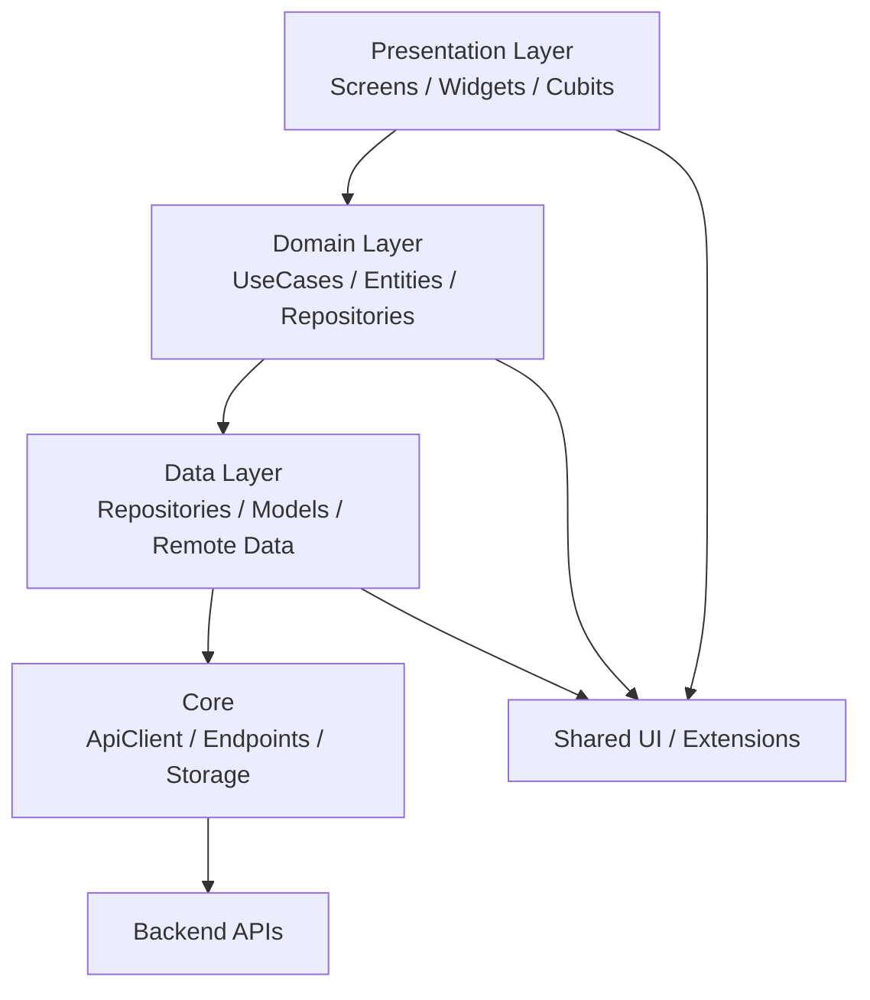

# Flutter Architecture for Locker Mobile

## Mục tiêu

Kiến trúc này phù hợp với app Locker hiện tại: nhiều feature, gọi API backend, có state phức tạp, và cần dễ mở rộng cho các màn như food order, delivery, send/receive, wallet, notifications, QR scan.

## Nguyên tắc chính

- Feature-first: mỗi nghiệp vụ nằm trong một feature riêng.
- Clean architecture: tách rõ presentation, domain, data.
- Dependency inversion: UI không phụ thuộc trực tiếp vào data source.
- State management thống nhất: ưu tiên `flutter_bloc` cho các màn có state.
- Shared core dùng chung cho networking, exceptions, routes, constants, helpers.
- Mọi request/response API đều đi qua repository + model mapping.

## Kiến trúc tổng quan



## Cấu trúc thư mục đề xuất

```text
lib/
  core/
    constants/
    exceptions/
    network/
    routes/
    services/
    utils/
  shared/
    extensions/
    widgets/
    themes/
  features/
    auth/
      data/
        models/
        repositories/
      domain/
        entities/
        repositories/
        usecases/
      presentation/
        controllers/
        pages/
        widgets/
    home/
    locker/
    food_order/
    delivery/
    send_receive/
    wallet/
    notifications/
    qr_scanner/
    profile/
    settings/
```

## Trách nhiệm từng layer

### 1. Presentation

Chứa UI và state.

- `pages/`: màn hình.
- `widgets/`: component tái sử dụng.
- `controllers/`: Cubit/BLoC, state classes.

Không gọi API trực tiếp từ UI.

### 2. Domain

Chứa logic nghiệp vụ thuần Dart.

- `entities/`: object domain không phụ thuộc framework.
- `repositories/`: abstract contract.
- `usecases/`: các hành động nghiệp vụ.

### 3. Data

Chứa implementation thực tế.

- `models/`: parse JSON.
- `repositories/`: gọi API hoặc local storage.
- `datasources/`: nếu sau này tách remote/local rõ hơn.

### 4. Core

Dùng cho toàn app.

- `ApiClient`, endpoints, constants.
- exceptions.
- route config.
- helpers, logger, validators.

### 5. Shared

Dùng chung giữa các feature.

- widgets tái sử dụng.
- extension.
- theme.

## Luồng dữ liệu chuẩn

1. UI gửi action vào Cubit/BLoC.
2. Cubit gọi UseCase.
3. UseCase gọi Repository interface.
4. Repository implementation gọi API qua `ApiClient`.
5. Response map vào Model.
6. Model trả về Entity.
7. Cubit cập nhật State.
8. UI rebuild theo State.

## Ví dụ áp dụng cho feature Delivery

### Presentation

- `SendReceiveScreen`
- `DeliveryCubit`
- `DeliveryState`

### Domain

- `DeliveryPackageSize`
- `SendDeliveryRequest`
- `IDeliveryRepository`
- `GetDeliveryPackageSizes`
- `CreateSendRequest`
- `SubmitReceiveCode`

### Data

- `DeliveryRepository`
- `DeliveryPackageSizeModel`

### Quy tắc

- UI chỉ hiển thị size và nhập phone.
- Cubit xử lý validate, load profile, gọi usecase.
- Repository tự map đúng payload theo backend.

## Ví dụ áp dụng cho feature Food Order

- UI chọn nhà hàng, menu, giỏ hàng.
- UseCase tạo đơn food order.
- Repository gọi endpoint food-orders.
- Model parse response đơn hàng.

## State management đề xuất

- Dùng `Cubit` cho state đơn giản đến trung bình.
- Dùng `Bloc` khi có event phức tạp.
- Không dùng setState cho business logic quan trọng.
- TextEditingController chỉ giữ trong UI, còn giá trị nghiệp vụ nên nằm trong state/cubit.

## Routing

- Tập trung ở `core/routes/app_router.dart`.
- Feature nào có page riêng thì expose route riêng.
- Không hardcode navigation logic trong repository hoặc usecase.

## Dependency Injection

Dùng `get_it` để inject:

- repositories
- usecases
- cubits

UI chỉ nhận instance từ DI hoặc tạo provider wrapper.

## Networking

- Mọi HTTP request đi qua `ApiClient`.
- Token gắn vào interceptor.
- 401 thì tự refresh token nếu cần.
- API endpoint tập trung ở `core/constants/api_endpoints.dart`.

## Naming convention

- Entity: danh từ số ít, ví dụ `DeliveryRequest`, `User`, `Locker`.
- UseCase: động từ hoặc hành động, ví dụ `GetDeliveryPackageSizes`.
- Repository interface: tiền tố `I`, ví dụ `IDeliveryRepository`.
- Model: hậu tố `Model`, ví dụ `DeliveryRequestModel`.
- State: hậu tố `State`.
- Cubit: hậu tố `Cubit`.

## Khi nào nên tách feature mới

Tách feature mới nếu:

- nghiệp vụ có màn hình riêng,
- có repository riêng,
- có entity/usecase riêng,
- hoặc cần lifecycle độc lập.

Ví dụ: `food_order`, `delivery`, `send_receive`, `wallet`.

## Khuyến nghị cho project hiện tại

1. Giữ kiến trúc feature-first như hiện tại.
2. Chuẩn hóa luồng gửi hàng về đúng BE contracts.
3. Tách rõ `delivery` và `send_receive` nếu nghiệp vụ khác nhau.
4. Mỗi feature nên có đủ 3 lớp: presentation, domain, data.
5. Khi thêm map, đặt vào `locker_map` hoặc `food_order` feature, không nhét vào `home`.

## Nếu làm feature map cho quán ăn

Nên thêm feature mới:

```text
features/
  restaurant_map/
    data/
    domain/
    presentation/
```

### Thành phần

- `RestaurantMapPage`
- `RestaurantMapCubit`
- `GetNearbyRestaurants`
- `RestaurantRepository`
- `RestaurantModel`

### Dữ liệu cần có

- `restaurantId`
- `name`
- `latitude`
- `longitude`
- `rating`
- `isOpen`
- `address`
- `imageUrl`

## Checklist thực thi

- [ ] Feature nào cũng có repository interface.
- [ ] Không gọi API trực tiếp từ UI.
- [ ] Không để model lọt ra UI.
- [ ] Không để entity phụ thuộc JSON.
- [ ] State chỉ chứa dữ liệu cần cho UI.
- [ ] Core chứa mọi hằng số và networking.

## Kết luận

Kiến trúc phù hợp nhất cho project này là **feature-first + clean architecture + Bloc + GetIt**.
Nó đủ linh hoạt để mở rộng app Locker, food order, delivery, map, wallet mà vẫn giữ code dễ đọc và dễ test.
